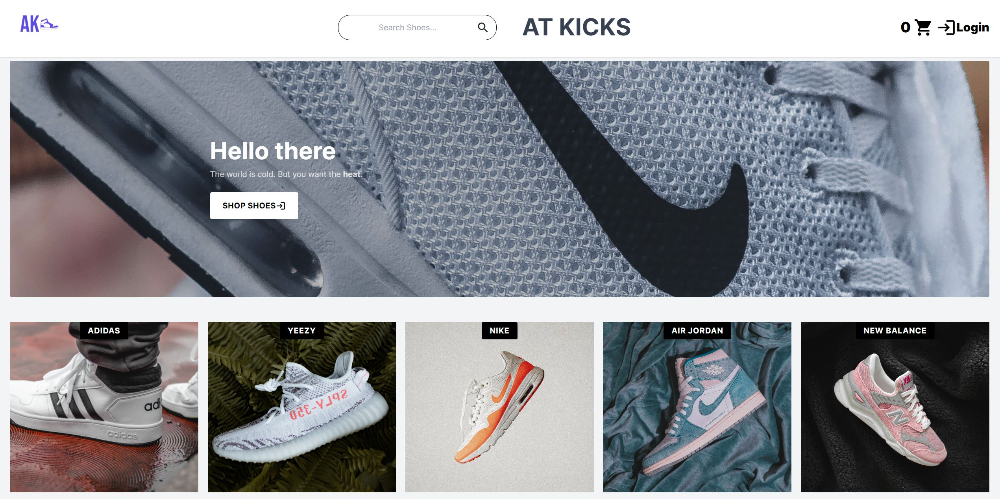
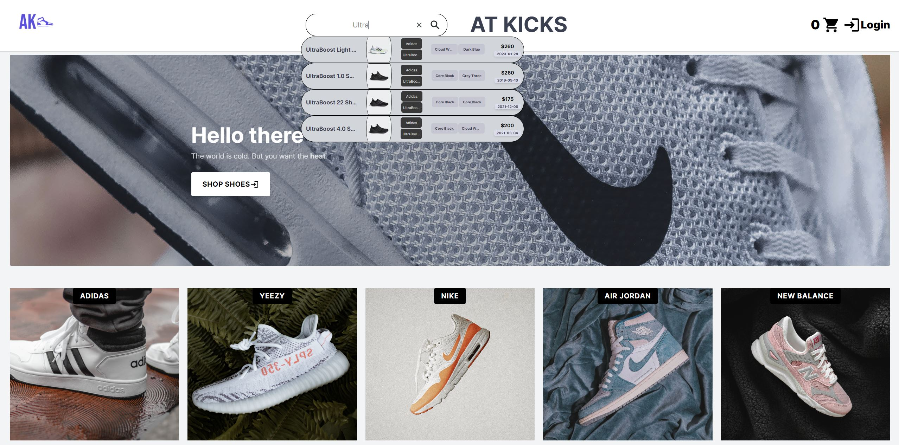
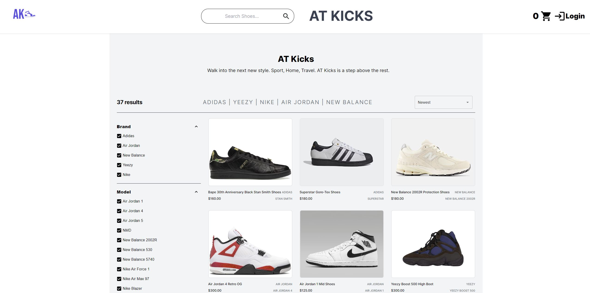
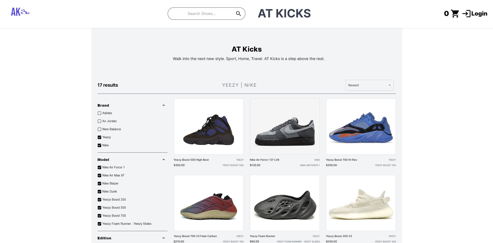
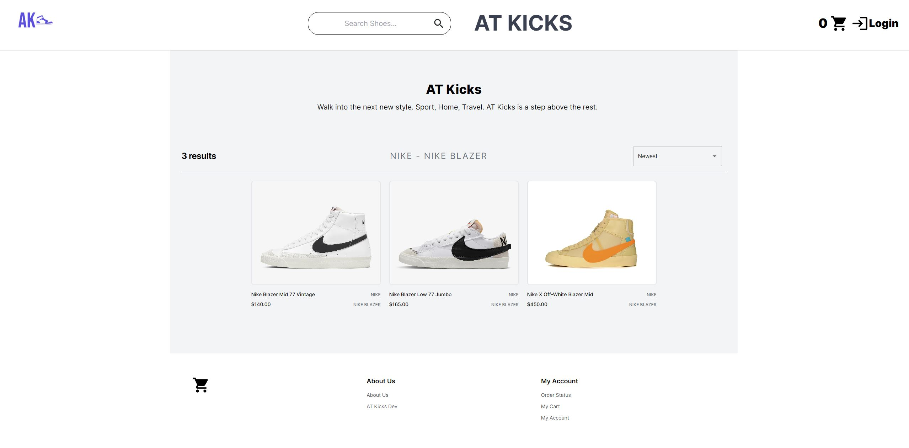
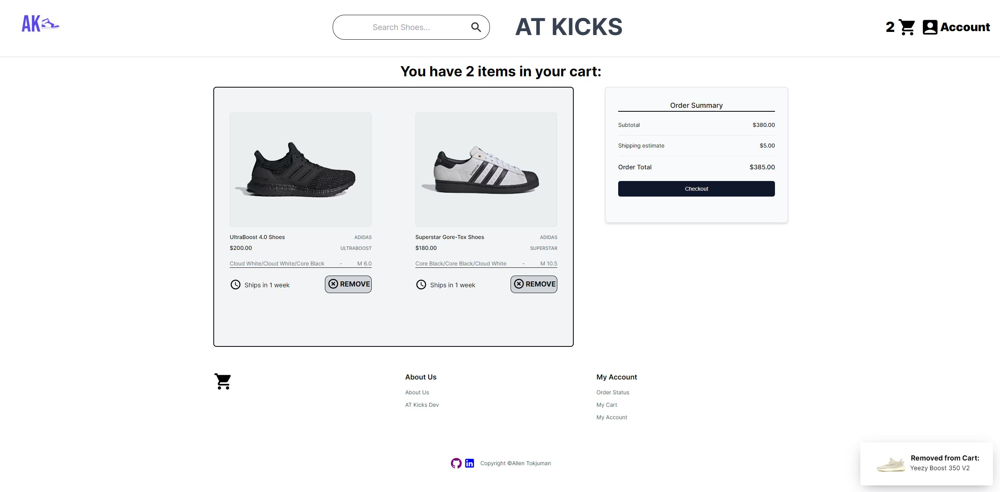
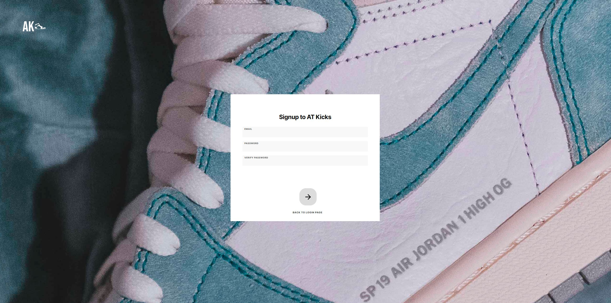

Please visit https://atkicks.allentok.com to enter AT Kicks!

This is the NodeJS/Express/Postgres/Caddy Dockerized REST API Container, which is hosted on DigitalOcean, to serve API calls made from the frontend, please refer to: https://github.com/allthetok/FrontEndEC to see how API calls are used in the NextJS app.

Refer to /helpers for any helper functions used within the endpoints, and /routes to see the individual routers such as tableRouter.ts for creating tables, productRouter.ts for product-related routes, userRouter.ts for user-related routes, insertDBRouter.ts for inserting data into the PG image dockerized container. See /src/serverrouter.ts to see the Express main app router.

Frameworks and Libraries Used:
- NodeJS
- ExpressJS
- PostgreSQL (Docker Image)
- Docker & Docker Compose
- Caddy (reverse proxy)
- Typescript
- Axios
- BCrypt
- Cors
- NodeMailer/SMTP Server

Here are some screenshots from the web app:

